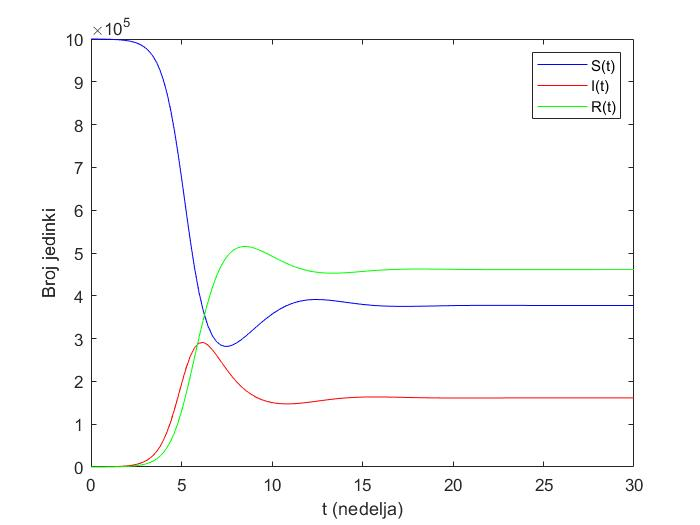
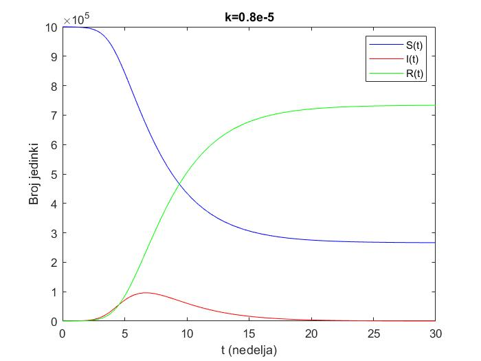
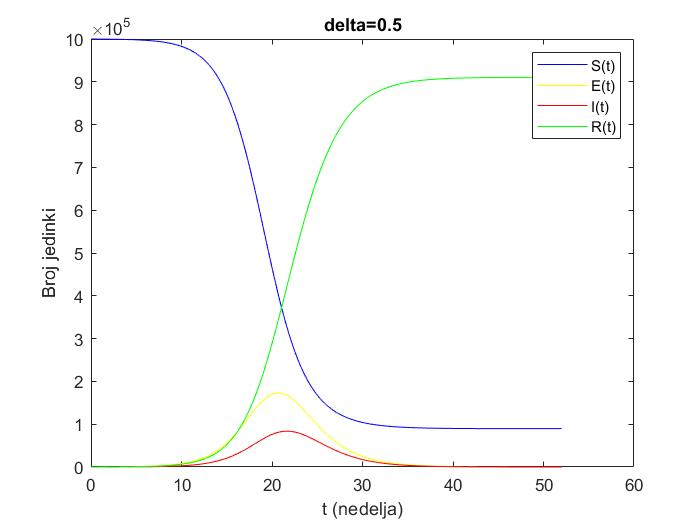

# epidemic-modelling
[Computer Modeling] SIR/SIRS/SIRQ/ISIR/SEIR differential equation models for numerical epidemic modelling in MATLAB.

Homework/project in **Practicum in Physics 2 (13E061PF2)** at University of Belgrade, School of Electrical Engineering.

## Comparmental models

### SIR model

- `S` is the number of susceptible individuals
- `I` is the number of infectious individuals
- `R` is the number of removed individuals (either immune or deceased)
- `α` is a constant that describes the infection rate
- `β` is a constant that describes the recovery rate

This model is described using the following system of first-order differential equations:
```
dS(t)/dt = -α * S * I
dI(t)/dt = -α * S * I - β * I
dR(t)/dt = β * I
```

The number of S/I/R individuals (for α = 2.65 * 10<sup>-6</sup>, β = 1) can be found below:


### SIRS model

- `γ` is a constant that describes the rate of immunity loss among recovered individuals (for example due to virus mutations)



### SIRQ model

- `q` is a constant that describes the rate of removal of infected individuals from the population
through preventive measures (for example quarantine)


### ISIR model

- `k` is a constant that describes the impact of the transfer epidemic information (for example due to self-isolation and avoiding contact)



### SEIR model

- `E` is the number of exposed individuals
- `δ` is a constant that describes the rate of transition of individuals from exposed to infectious population (for example due to the incubation period)


